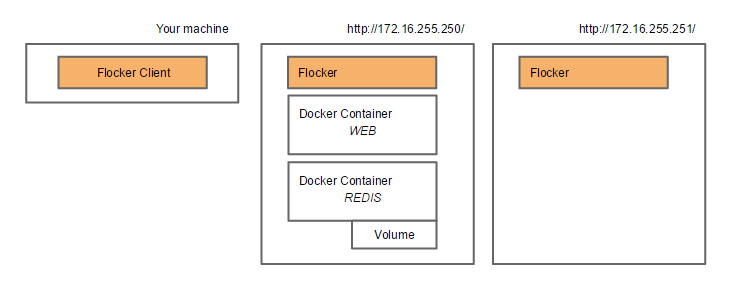
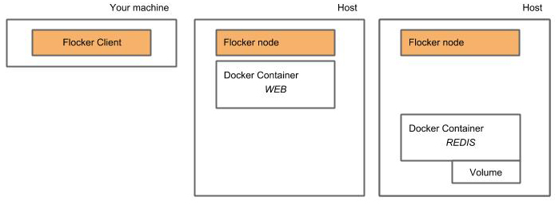
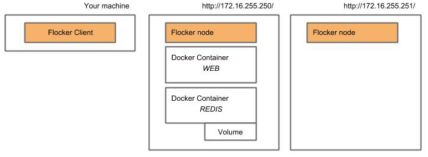
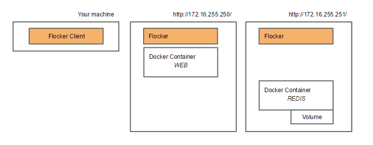

.. _try:

===========
Try Flocker
===========

In this tutorial (30 mins)
--------------------------

You will use Flocker to migrate a Docker container with its volume from one host to another. The container you move will be part of a two-container application, the other container will not move and the two will remain connected even when they are on different hosts. 

To begin the tutorial you will first install the Flocker client on your local machine, then install the Flocker node application onto two hosts. You will then be ready to use Flocker to migrate a Docker container with a volume attached from one host to the other.

You will need
-------------

1)	Somewhere to install the Flocker client. Make sure you have **one** of the following on your machine:

	- OSX with Homebrew installed.
	- Fedora 20.
	- Ubuntu 14.04.

2) 	Two hosts for the two instances of Flocker node. The options are:

	- Two Virtual Machines (VMs) on your local machine. For this tutorial, you are supplied with Vagrant images to create the tutorial environment on VMs using VirtualBox, so you must have Vagrant and VirtualBox installed.
	- AWS or Rackspace (you will need an account with root access).
	- Physical hosts with a supported operating system.
	- Any combination of the above.

.. note:: If you choose to use VMs on your local machine, you’ll need at least 4GB RAM.

Contents
--------

.. contents:: 
	:local:
	:depth: 2
	
Overview
^^^^^^^^

The following diagram illustrates the setup that you will create first:

The following diagram illustrates how the setup will be configured at the end of the tutorial:

Flocker manages the data migration and the link between the two containers.

.. To find out more about how Flocker managers migration of containers with volumes, see *add link here* 

Step 1: Installing the Flocker client
^^^^^^^^^^^^^^^^^^^^^^^^^^^^^^^^^^^^^

The Flocker client runs locally on your machine and controls the two Flocker nodes on the hosts. To install the Flocker client, run the following in your terminal:

OSX
***
.. code-block:: console

	you@laptop:~$ brew update && \
	  brew tap clusterhq/flocker && \
	  brew install flocker-0.5.0

Ubuntu 14.04/Debian
*******************
.. code-block:: console

	you@laptop:~$ sudo apt-get update && sudo apt-get install -y gcc python2.7 	python-virtualenv python2.7-dev && \
	  virtualenv flocker-tutorial && \
	  flocker-tutorial/bin/pip install --upgrade pip && \
	  flocker-tutorial/bin/pip install --quiet https://storage.googleapis.com/archive.clusterhq.com/downloads/flocker/Flocker-0.4.0-py2-none-any.whl && source flocker-tutorial/bin/activate

Fedora 20
*********
.. code-block:: console

	you@laptop:~$ sudo yum install -y @buildsys-build python python-devel 	python-virtualenv && \
	  virtualenv flocker-tutorial && \
	  flocker-tutorial/bin/pip install --upgrade pip && \
	  flocker-tutorial/bin/pip install --quiet https://storage.googleapis.com/archive.clusterhq.com/downloads/flocker/Flocker-0.4.0-py2-none-any.whl && source flocker-tutorial/bin/activate

.. note:: To test your installation, run the following to check that you have the Flocker client installed correctly:

   .. code-block:: console
 
	you@laptop:~$ flocker-deploy --version
   
   Successful installation will display the latest version of Flocker.

Step 2: Installing the Flocker node
^^^^^^^^^^^^^^^^^^^^^^^^^^^^^^^^^^^
Option A: Installing the Flocker node on local VMs
**************************************************

.. note:: You must have Vagrant and VirtualBox installed to create the VMs and start the containers for this tutorial.

In Step 1 you installed the Flocker client on your local machine. You now need two instances of the Flocker node, each on a separate host. The Flocker node manages the links, ports, and volumes associated with Docker containers and can move them around after deployment. To install the Flocker node (plus dependencies), run the following commands and Vagrant will create the environments you need: 

.. code-block:: console

	you@laptop:~$ git clone \
	  https://github.com/clusterhq/vagrant-flocker && \
	  cd vagrant-flocker && \
	  vagrant up && \
	  [ -e "${SSH_AUTH_SOCK}" ] || eval $(ssh-agent) && \
	  ssh-add ~/.vagrant.d/insecure_private_key

.. note:: To test your installation, run the following to check that you have the Flocker client installed correctly:

   .. code-block:: console
 
	you@laptop:~$ vagrant ssh node1 -c "flocker-reportstate --version" 

   Successful installation will display the latest version of Flocker, and confirm the closure of the connection:

   .. code-block:: console

	0.4.0
	Connection to 127.0.0.1 closed.

Option B: Installing the Flocker node on AWS or Rackspace
*************************************************************************

The two instances of the Flocker node each run on a separate host. The Flocker node manages the links, ports, and volumes associated with Docker containers and can move them around after deployment. To install the Flocker node (plus dependencies), follow the links to the direct instructions:

- :ref:`AWS install instructions <aws-install>`
- :ref:`Rackspace install instructions <rackspace-install>`

Step 3: Deploying an app on the first host
^^^^^^^^^^^^^^^^^^^^^^^^^^^^^^^^^^^^^^^^^^

You will now have the Flocker client installed on your local machine and two instances of the Flocker node, each on a different host. Now you will create two Docker containers on one of the hosts. One is a web application and the other is redis database application, which stores its data on a volume.

First, download the sample Python web application and Redis server that we have provided on GitHub.:

.. code-block:: console

	you@laptop:~$ git clone https://github.com/clusterhq/flocker-quickstart
	you@laptop:~$ cd flocker-quickstart

.. note:: You will find 3 .yml files in the downloaded tutorial folder. These contain the application and deployment config. You can edit these files if you need to change the IP addresses to match your hosts'

Secondly, install the web application\
 and server on the first host:

.. code-block:: console

	you@laptop:~$ flocker-deploy deployment-node1.yml fig.yml

Visit http://172.16.255.250/ (or the IP of the first host that you are using). You will see the visit count displayed.

Visit http://172.16.255.251/ (or the IP of the second host that you are using). You will see that the count persists because Flocker routes the traffic from either host named in the deployment file to the one that has the application.

.. note:: Run the following from within the vagrant-flocker folder to check that the Redis container is running on the first host:

   .. code-block:: console
   
	 you@laptop:~$ cd vagrant-flocker
	 you@laptop:~$ vagrant ssh node1 -c "docker ps" 
     

   You should see the Redis container in the output from Docker.
   
   If you are running on AWS, manually SSH onto the first node and run :code:`docker ps` to see the same output.

Step 4: Migrating a container to the second host.
^^^^^^^^^^^^^^^^^^^^^^^^^^^^^^^^^^^^^^^^^^^^^^^^^

The diagram below illustrates your current setup:

To move the container with the Redis server along with its data volume, run flocker-deploy with a different deployment .yml file: 

.. code-block:: console

	you@laptop:~$ flocker-deploy deployment-node2.yml
	
The Redis container and its volume have now both been moved to the second host. Flocker has maintained its link to the web application on the first host.

Visit http://172.16.255.250/ (or the IP of the first host that you are using). You will see the visit count is still persisted.

Visit http://172.16.255.251/ (or the IP of the second host that you are using). You will see that the count still persists, even though the container with the volume has moved between hosts.

.. note:: Run the following from within the vagrant-flocker folder to check that the Redis container is running on the first host:

   .. code-block:: console
   
	 you@laptop:~$ cd vagrant-flocker
	 you@laptop:~$ vagrant ssh node2 -c "docker ps" 
     

   You should see the Redis container in the output from Docker.
   
   If you are running on AWS, manually SSH onto the second node and run :code:`docker ps` to see the same output.

Success!
^^^^^^^^

You have now set up your first Flocker cluster and moved a Docker container with its volume while persisting its link to a web app on another server. 

The following diagram illustrates how your setup looks now:

